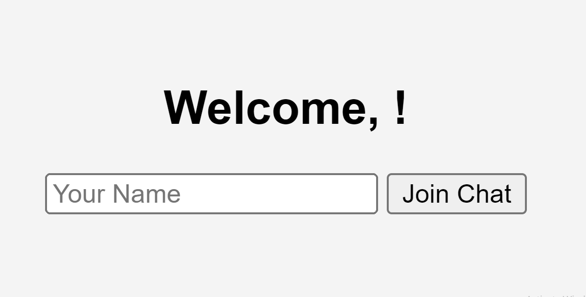
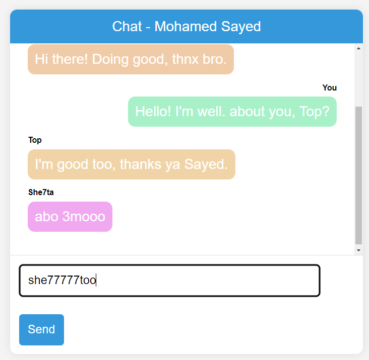
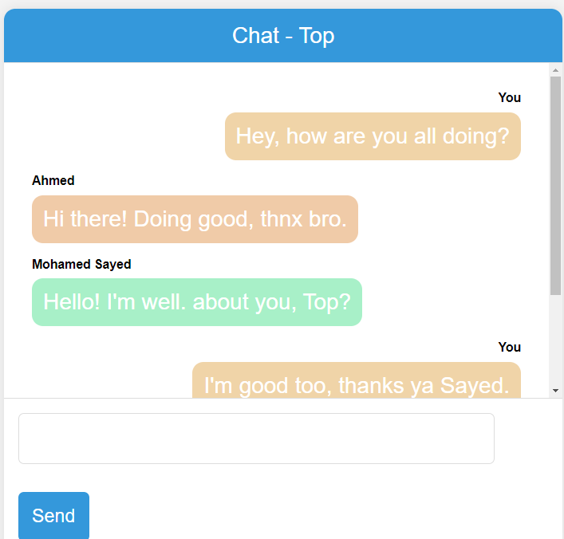

# Real-time Chat Application

Welcome to our real-time chat application! This simple chat app allows you to engage in real-time conversations with your friends. Join the chat, connect with others, and enjoy seamless communication.

## Features

- **User-Friendly Interface**: The app provides an easy-to-use interface for a smooth chatting experience.
- **Real-Time Communication**: Engage in real-time conversations with friends without any delay.
- **User Name and Color**: Customize your user name and see messages in different colors for each user.

## How to Use

1. **Join the Chat**:

   - Enter your name in the provided input box.
   - Click the "Join Chat" button.

2. **Chat Interface**:

   - Once joined, you'll see a chat interface with your name at the top.
   - Send messages using the input box and click "Send."

3. **Real-Time Interaction**:
   - Messages from different users are displayed with their respective colors.

## Screenshots

_Screenshoot of the join screen where users can enter their names and join the chat._

_Example of a chat conversation between friends._

_Another snapshot showcasing the chat interface._

---

Feel free to explore, share your thoughts, and have fun chatting with your friends!

**Contact Information:**

For any inquiries or collaboration opportunities, you can reach out to me:

- **LinkedIn**: [LinkedIn Profile](https://www.linkedin.com/in/m7mmed-sayed/)
- **Email**: mohamedsayed1167@gmail.com

---
